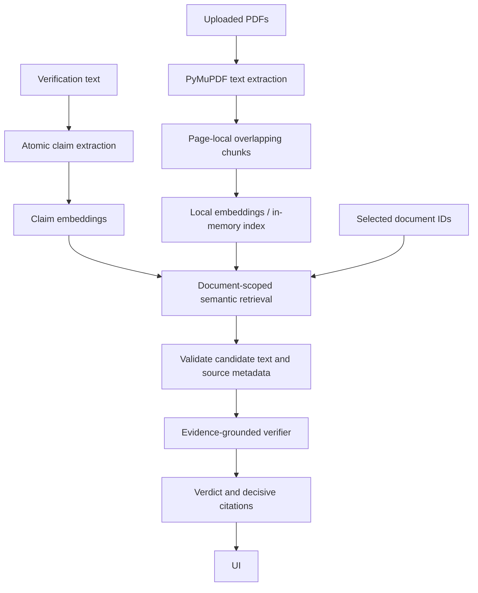

# EvidenceLens

Check factual text against user-supplied PDF documents, with document and page citations.

## Current milestone: evidence-grounded semantic verification

The working pipeline now includes a replaceable model-backed verifier. PDF uploads and response shapes remain compatible; each result's evidence list now contains only verifier-selected decisive citations. No accounts, authentication, payments, web search, or document persistence have been added.



### Claim extraction

`AtomicClaimExtractor` implements the existing `ClaimExtractor` protocol with deterministic English heuristics. It recognizes common predicates, splits independent clauses and simple shared-subject predicates, preserves reporting phrases, and skips obvious opinions and questions. It does not split every occurrence of “and.” Conditions, negation, modality, quotes, and reported clauses are conservatively retained when splitting could change meaning.

For example:

> The study included 312 adults. Participants completed the survey online, and researchers found that sleep quality improved after the intervention.

becomes three typed claims: “The study included 312 adults.”, “Participants completed the survey online.”, and “Researchers found that sleep quality improved after the intervention.”

All output passes a bounded Pydantic schema. `StructuredClaimExtractor` is an optional injection adapter for a future `StructuredClaimProvider`; it accepts only JSON `{ "claims": [{ "text": "..." }] }`, rejects extra fields, wrong types, blank text, oversized responses, and more than 100 claims, and reports malformed output as HTTP 502. Claim extraction still uses heuristics by default; semantic verification uses a separate local model. Schema validation checks structure, not whether a model preserved the input's meaning.

### Chunking and embeddings

PDF text is split into verbatim page-local windows, default maximum **1,000 characters**, with up to **150 characters of overlap**. The splitter prefers sentence boundaries, then word boundaries. Long sentences or tokens can require a hard cut. Whitespace trimming is the only change to citation text. Chunks never cross pages; every chunk retains its own document UUID, filename, one-based page number, and passage UUID.

The smaller windows reduce topic dilution and overlap retains some surrounding context. Internal chunk metadata tracks which original page sentences remain complete, so a hard-cut sentence fragment cannot become exact-match support. This metadata does not change the evidence API. Character limits are a practical English approximation, not a tokenizer limit: unusual text can still exceed a model's token budget, and tables, complex PDF reading order, and sentences spanning pages remain limitations. Overlapping passages may both be retrieved.

`FastEmbedProvider` implements a replaceable `EmbeddingProvider` with separate document and query methods. The default is **`sentence-transformers/all-MiniLM-L6-v2`**, a local CPU embedding model run through FastEmbed/ONNX. The model was chosen after comparing it with BGE-small on the committed fixtures; MiniLM ranked the intended source first for every positive fixture. This small evaluation is not a general quality benchmark. See [FastEmbed retrieval usage](https://qdrant.github.io/fastembed/qdrant/Retrieval_with_FastEmbed/) and [supported models](https://qdrant.github.io/fastembed/examples/Supported_Models/).

Uploads generate chunk embeddings before documents become available. Vectors are validated for count, dimensions, finite values, and nonzero norm. `SemanticRetriever` caches up to 4,096 content-keyed vectors in memory, reuses them for subsequent requests, and recomputes evicted entries as needed. It ranks only the selected passages by cosine similarity using a simple linear scan; no vector database is required for this local milestone. Query and document vectors always use the same provider instance/model.

### Verification and trust boundaries

**Retrieval determines relevance. Verification determines evidentiary relationship.**

The existing `Verifier` interface now has two implementations: `EvidenceGroundedVerifier` (the default) and `ExactSentenceVerifier` (an explicitly selected development baseline). The semantic verifier depends on a provider protocol; `ChatCompletionProvider` handles a compatible chat-completions HTTP endpoint. Local llama.cpp is the prepared deployment, with no tools or network searches available to the model. A hosted compatible provider can be configured explicitly; that would transmit the claim and candidate passages to that provider.

| Verdict | Meaning |
| --- | --- |
| `supported` | All material factual components and qualifiers are established, including by paraphrase or joint evidence. |
| `partially_supported` | A meaningful portion is established; another material component is missing, and none is directly contradicted. Topic overlap alone does not qualify. |
| `contradicted` | At least one material component directly conflicts with evidence for the same entity, event, and temporal scope. |
| `insufficient_evidence` | Evidence cannot establish the claim or a meaningful portion, cannot directly contradict it, or materially conflicting sources require abstention. |

For example, 312 participants supports “more than 300”; adults without a count partially supports “312 adults”; 212 contradicts an asserted exact total of 312. Possibility does not establish actuality, association does not establish causation, and some does not establish all. The benchmark distinguishes numeric ranges, date precision, before/after, entity identity, and comparison direction.

The verifier receives **only the atomic claim, selected retrieved passages, and their metadata**. Selected-document scoping is checked before verification and every returned citation is checked again afterward. The provider has no document store, unselected passages, browsing tools, or retrieval scores. Similarity is never supplied as proof or displayed as confidence.

Each model result must satisfy `VerifierOutput`: verdict, concise explanation, decisive evidence labels, conflict flag, and one assessment per candidate. Non-irrelevant assessments require verbatim source quotes. The backend rejects extra fields (including confidence), unknown or duplicate labels, omitted assessments, invented quotes, inconsistent decisions, and unsupported sentence fragments. Stable UUIDs and original filenames/page numbers are restored from canonical candidates; the model never supplies citation metadata to the UI. Quote and schema validation establish provenance and structure, not entailment correctness.

The transport requests structural schema constraints; length and collection bounds are enforced locally by the full Pydantic schema to avoid excessive grammar expansion in local runtimes. HTTP output bytes and generation tokens are also bounded. The frontend proxy allows up to 180 seconds for local inference; large multi-claim requests can exceed that budget and should be split into smaller submissions.

**Conflicts:** the model must inspect every candidate and flag material source disagreement. A conflict flag, or whole-claim support alongside a materially contradictory assessment, forces `insufficient_evidence` with an explicit conflict explanation and citations from both sides. No authority ranking is invented. Supporting one clause while contradicting a different clause is a contradicted compound claim, not automatically source disagreement. Disagreement in passages that retrieval misses cannot be detected.

**Prompt injection:** instructions live in a system message; claim, filenames, and evidence are serialized separately as untrusted JSON data. A small deterministic guard abstains before calling the provider when content contains obvious verifier-directed instructions such as ignoring previous instructions, forcing a verdict, or requesting evidence IDs. It conservatively abstains on the entire claim, including when a suspicious passage also contains facts. Other content remains untrusted data under the model prompt. Legitimate discussion of these instructions can trigger abstention, and the pattern guard is not a complete injection detector. The initial local-model evaluation demonstrated that prompting alone was insufficient; the application does not rely on that alone.

**Fail closed:** empty evidence abstains without a provider call. Malformed, incomplete, oversized, ungrounded, or inconsistent model output returns HTTP 502; timeouts, unavailable providers, and excessive model inputs return HTTP 503. The API returns no partial batch of verdicts when one fails. There is no automatic fallback to exact-match support. Logs distinguish transport and validation failures without raw prompts, responses, credentials, or chain-of-thought.

**Observability:** set `EVIDENCELENS_DEBUG_PIPELINE=true` to log claim UUIDs, candidate UUIDs/ranks/cosine values, selected UUIDs, and final verdicts. Match claim UUIDs to the response for local debugging. Candidate lists remain internal; the UI shows only decisive passages, which may support, contradict, or demonstrate conflict.

**Limitations:** local models are fallible and may misinterpret quantities, qualifiers, causality, conflicts, or malicious text despite a valid schema. The checks cannot prove that an explanation follows logically from its quotes or that the model ignored all prior knowledge. Atomic extraction remains a conservative English heuristic; pronouns, uncommon verbs, complex syntax, and non-English text can remain compound or be missed. Retrieval can omit evidence. Model context/input limits bound each request; long inputs fail explicitly rather than being silently truncated. Document truth and source authority are not independently established. Documents and vectors remain in memory.

## Run

Requires Python 3.11+ and Node.js 20.9+. Run commands from the repository root unless indicated.

```powershell
python -m venv venv
.\venv\Scripts\python.exe -m pip install -e "./backend[dev]"
.\venv\Scripts\python.exe -m app.prepare_model
.\venv\Scripts\python.exe -m uvicorn app.main:app --app-dir backend --reload --host 127.0.0.1
```

Preparing the embedding model requires network access once to download public weights (roughly 90 MB for the default embedding model). Document text and claims are never uploaded to a model service. Weights are cached under `.cache/fastembed`; user documents and their vectors remain in process memory. Preparation is optional but avoids first-upload latency. Once cached, set `$env:HF_HUB_OFFLINE='1'` for offline operation. Missing or failed embeddings return HTTP 503; there is no silent lexical fallback.

Prepare the local semantic verifier once (Windows CPU runtime plus about **1.9 GB** of Qwen3-4B-Instruct-2507 Q3_K_S weights). The script pins and verifies SHA-256 hashes and checks available disk space with a 256 MiB reserve. The model also needs several GB of available RAM; CPU verification can take tens of seconds per claim.

```powershell
.\venv\Scripts\python.exe scripts/prepare_local_verifier.py
.\scripts\start_local_verifier.ps1
```

Keep this model server running in its own terminal. It binds only to `127.0.0.1:8081`, disables the model-server web UI, and serves the alias `evidencelens-verifier`. Runtime and weights remain ignored under `.cache/verifier`. The backend does not start or download a verifier implicitly. Other platforms can run their own compatible local server at the configured URL. See [llama.cpp server](https://github.com/ggml-org/llama.cpp/blob/master/tools/server/README.md) and the [model distribution](https://huggingface.co/bartowski/Qwen_Qwen3-4B-Instruct-2507-GGUF).

In another terminal:

```powershell
cd frontend
npm ci
npm run dev
```

Open http://localhost:3000. The frontend proxies `/api/*` to `http://127.0.0.1:8000`; set `BACKEND_URL` before building/starting Next.js to change it. Interactive API docs: http://127.0.0.1:8000/docs.

Documents disappear on backend restart. Run one backend worker for this local workspace; there is no cross-worker/shared-user document store.

## Configuration

`.env.example` lists the process environment variables. It contains no secrets and is not automatically loaded. Set values in your shell before starting the backend, for example `$env:EVIDENCELENS_RETRIEVAL_TOP_K='3'`.

| Variable | Default | Purpose |
| --- | --- | --- |
| `EVIDENCELENS_EMBEDDING_MODEL` | `sentence-transformers/all-MiniLM-L6-v2` | Supported FastEmbed text model |
| `EVIDENCELENS_EMBEDDING_CACHE_DIR` | Repository `.cache/fastembed` | Writable weight cache |
| `EVIDENCELENS_EMBEDDING_THREADS` | `2` | CPU inference threads, 1–32 |
| `EVIDENCELENS_RETRIEVAL_TOP_K` | `5` | Maximum passages per claim, 1–50 |
| `EVIDENCELENS_RETRIEVAL_MIN_SIMILARITY` | `0.45` | Minimum cosine score, −1 to 1 |
| `EVIDENCELENS_CHUNK_MAX_CHARS` | `1000` | Window bound, 100–2000 |
| `EVIDENCELENS_CHUNK_OVERLAP_CHARS` | `150` | Target overlap, 0–500 and smaller than window |
| `EVIDENCELENS_VERIFIER_MODE` | `model` | `model` or explicit `exact` development baseline |
| `EVIDENCELENS_VERIFIER_BASE_URL` | `http://127.0.0.1:8081/v1` | Compatible endpoint; no credentials in URL |
| `EVIDENCELENS_VERIFIER_MODEL` | `evidencelens-verifier` | Model name/alias |
| `EVIDENCELENS_VERIFIER_API_KEY` | empty | Optional secret for an explicitly configured hosted endpoint |
| `EVIDENCELENS_VERIFIER_TIMEOUT_SECONDS` | `120` | Per HTTP operation timeout, up to 600 seconds |
| `EVIDENCELENS_VERIFIER_MAX_INPUT_CHARS` | `16000` | Claim/evidence JSON budget, including metadata |
| `EVIDENCELENS_DEBUG_PIPELINE` | `false` | Log metadata-only pipeline traces |

The threshold was checked against the small evaluation fixtures; tune it on representative documents for each embedding model. Higher thresholds improve precision at the risk of missing evidence. Restart and re-upload documents when changing model/chunking settings. Invalid settings fail startup.

## API contracts

- `Document`: UUID, original filename, page count, passage count.
- `Passage` / `Evidence`: passage UUID, document UUID/name, one-based page number, source text.
- `Claim`: UUID and claim text.
- `VerificationResult`: claim, classification, explanation, retrieved evidence.
- `POST /api/documents`: multipart `files`; returns `201 {documents: Document[]}`. Upload batches are atomic from the document store's perspective, including embedding failures. A failed batch may leave reusable derived vectors in the bounded memory cache, but makes no documents queryable.
- `POST /api/verifications`: JSON `{text: string, document_ids: UUID[]}`; returns `{results: VerificationResult[]}`. Unknown document IDs fail before extraction/retrieval.
- Limits: 10 PDFs per upload, 10 MiB each, 200 pages each, 2 million extracted characters per file, 100 documents per process; 20,000 verification characters, 100 selected IDs, 100 sentence candidates and 100 extracted claims. Image-only and encrypted PDFs are rejected.
- Errors: `413` upload size/capacity, `422` invalid input/PDF/claim count, `404` unknown document, `502` invalid claim/verifier output or evidence scope violation, `503` embedding/verifier service failure or verifier input limit. No partial verification response is returned on service failure.

## Tests and examples

See [the milestone validation record](docs/verification-validation.md) for executed checks, live examples, latency observations, and evaluation limits.

Deterministic regression suite (no model downloads):

```powershell
.\venv\Scripts\python.exe -m pytest backend/tests -q
```

Complete suite including real embedding evaluation, after preparing the model:

```powershell
$env:EVIDENCELENS_TEST_MODEL='1'
$env:HF_HUB_OFFLINE='1'
.\venv\Scripts\python.exe -m pytest backend/tests -q
```

The ordinary suite skips seven embedding integration tests and 26 live-verifier benchmark cases. Existing regression tests explicitly use the exact baseline through the test fixture, and semantic verifier unit tests use deterministic mocked provider output. Unit tests use named stubs only for deterministic index math and boundary checks; the real model tests exercise all committed paraphrase/negation fixtures and PDF-to-verification scoping. Fixtures live in `sample_data/semantic_cases.json`.

```powershell
cd frontend
npm run typecheck
npm run build
```

Generate PDFs with `.\venv\Scripts\python.exe sample_data/generate_sample.py` (original observatory demo) or `.\venv\Scripts\python.exe sample_data/generate_semantic_sample.py`. Upload `semantic-trial.pdf` and paste “More than 300 people took part in the trial.” The top candidate should cite page 1, “The trial enrolled 312 participants.” With the local verifier running, the verdict should be `supported`. The blood pressure fixture on page 2 should produce `contradicted` for “The intervention significantly reduced blood pressure.” An unrelated claim should return `insufficient_evidence`.

The human-readable semantic verification benchmark is `sample_data/verification_cases.json`: 26 positive, negative, partial, conflict, abstention, and adversarial cases covering the requested reasoning categories. Mocked tests validate the adapter, aggregation, citations, and error behavior; they do **not** measure model reasoning accuracy.

Run verifier unit tests without a model server:

```powershell
.\venv\Scripts\python.exe -m pytest backend/tests/test_verification.py backend/tests/test_verifier_provider.py -q
```

Run the optional live benchmark against the configured provider:

```powershell
$env:EVIDENCELENS_TEST_VERIFIER='1'
.\venv\Scripts\python.exe -m pytest backend/tests/test_verifier_live.py -q
```

Changing model or quantization may change benchmark outcomes. Do not interpret passing mocked tests as live model accuracy. Unset this variable to return to the offline test suite.

With the model server, backend, and production frontend running, execute the repeatable end-to-end check:

```powershell
.\venv\Scripts\python.exe scripts/smoke_verification.py
```

It uploads a generated PDF through the frontend proxy and asserts semantic support, negated contradiction, abstention, and page citations. If a weight download is interrupted, rerun the preparation command to resume its partial file.

### Dependency warnings

The deprecated HTTPX TestClient fallback was resolved by using `httpx2` in development dependencies. Starlette 1.6.0 still references `anyio.abc.BlockingPortal` in `starlette/testclient.py:53`; AnyIO 4.15.1 emits a deprecation warning recommending `anyio.from_thread.BlockingPortal`. This is third-party code; the warning remains visible rather than being suppressed or patched locally.

On Windows, initial weight downloads may warn about unavailable symlinks (additional disk usage) and unauthenticated Hugging Face requests (lower rate limits). FastEmbed can use its alternate download source if necessary. These do not require API keys or changes to verification behavior.

The pinned Qwen GGUF also emits a llama.cpp warning that one control-looking token is reclassified during model loading. The server applies that metadata correction and continues; live verification is checked separately. No dependency or model warnings are hidden.

Further work should expand and calibrate the verification benchmark, strengthen model evaluation, and measure latency and abstention behavior. Persistent storage and authentication remain out of scope.
