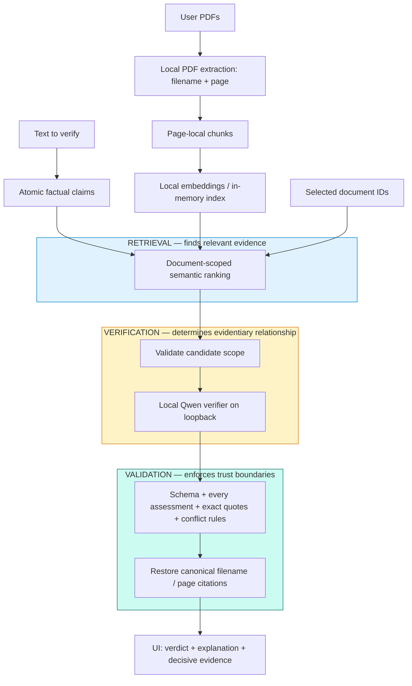

# EvidenceLens

**Check AI-generated claims against your documents, with evidence you can inspect.**

A local-first Next.js + FastAPI application that separates finding relevant passages
from deciding whether they establish a claim.

## The problem

AI-generated factual claims can sound credible even when their sources do not
support them. A relevant search result alone is not proof.

## What EvidenceLens does

Upload PDFs, paste text, and review atomic factual claims. EvidenceLens retrieves
passages from the documents you select, evaluates each claim against only those
passages, and displays a verdict, explanation, and decisive filename/page citations.

**Try sample** loads a fictional three-page study and four claims. Choose **Verify
claims** to run the real pipeline. No stored or fabricated AI results are used.
The interface shows elapsed time while the local CPU works; a four-claim check can
take minutes. A 30–60 second presentation should use a completed live run.

## Why it is different

- Retrieval and verification are separate: similarity ranks candidates, never truth or confidence.
- Missing evidence and detected source conflicts lead to conservative abstention.
- Every candidate is assessed; decisive citations are checked against original text.
- Selected document IDs constrain retrieval and final citation validation.
- The default verifier runs locally behind a replaceable service interface.

## Architecture



## Evaluation

**22/26 live benchmark cases passed (84.6%).** Failures involved modality, causation,
entity identity and compound-claim conflict handling. Expected-class accuracy was
100% for support and partial support, 87.5% for contradiction, and 57.1% for
insufficient evidence. All returned citations passed provenance checks.

The final backend suite with real embeddings passed 149 tests. Warm model calls
had a 39.3-second median; the cold first request took 103.0 seconds, excluding
20.3 seconds of server startup. Prewarming moves cold work ahead of a demo.

See the [complete live benchmark and performance report](docs/evaluation/README.md)
and [raw per-case results](docs/evaluation/live-results.json). The 26 synthetic cases
exercise quantities, dates, qualifiers, causality, entity identity, conflicts and
adversarial instructions. The benchmark supplies passages directly to the verifier;
it does not measure end-to-end retrieval or extraction accuracy.

Ordinary tests use deterministic providers and do not need a running model.
Live evaluation includes failures; valid citations do not prove correct reasoning.
The [previous milestone record](docs/verification-validation.md) is retained as history.

## Trust boundaries and limitations

The default app processes uploads locally and sends only the claim and retrieved
evidence to its loopback verifier. Changing provider/backend configuration changes
that boundary. Model weights require a one-time download.

Document content is untrusted. Obvious verifier-directed instructions trigger
abstention; this is not complete prompt-injection protection. Models can misread
facts despite schema and quote validation. Retrieval can miss evidence, and atomic
claim extraction uses conservative English heuristics.

The application keeps extracted text in its in-memory document store and also
holds retrieval vectors in memory. The store is cleared on backend restart.
During upload, FastAPI may spool incoming files
above its framework threshold to temporary disk storage. Cleanup closes those
files; closing/deleting them does not guarantee secure erasure. Documents are not
exclusively memory-resident throughout upload. The separate verifier maintains an in-memory
prompt cache; restart it too to end a sensitive session. There are no formal
security or correctness guarantees. See [privacy and threat model](docs/privacy.md)
and [implementation details](docs/implementation.md).

## Running locally

The commands below target Windows PowerShell. Install Git, Python 3.11+ and
Node.js 20.9+. Clone the repository and enter its root directory:

```powershell
git clone https://github.com/Hamza-Syed/EvidenceLens.git
cd EvidenceLens
```

While the repository is private, cloning requires GitHub access. No API key is
needed for the default local verifier. Other operating systems need their own
compatible local verifier runtime; the preparation script downloads Windows CPU binaries.

### One-time preparation — repository root

```powershell
python -m venv venv
.\venv\Scripts\python.exe -m pip install -e "./backend[dev]"
.\venv\Scripts\python.exe -m app.prepare_model
.\venv\Scripts\python.exe scripts/prepare_local_verifier.py
npm --prefix frontend ci
```

Preparation downloads public embedding weights (roughly 90 MB) and the pinned
Windows verifier runtime plus about **1.9 GB** of Qwen3-4B-Instruct-2507 Q3_K_S
weights. The verifier download is SHA-256 checked and requires a 256 MiB disk
reserve. The model also needs several GB of available RAM. Assets are cached under
`.cache/fastembed` and `.cache/verifier`; they are not committed.

With the default configuration, document text and claims stay within the local
application and loopback verifier. The application store contains extracted text
and vectors in memory; uploads may use temporary disk files as described above.
After preparing the embedding weights, `HF_HUB_OFFLINE=1` avoids further embedding
model downloads. Missing embeddings return HTTP 503, with no lexical fallback.

Keep three separate terminals open. In each new terminal, first navigate to the
clone's repository root; do not assume another terminal's working directory carries over.

### Terminal 1 — verifier; working directory: repository root

```powershell
.\scripts\start_local_verifier.ps1
```

Leave this process running. It binds to `127.0.0.1:8081`, disables the model-server
web UI, and serves the alias `evidencelens-verifier`. The backend does not start or
download it implicitly. See [llama.cpp server](https://github.com/ggml-org/llama.cpp/blob/master/tools/server/README.md)
and the [model distribution](https://huggingface.co/bartowski/Qwen_Qwen3-4B-Instruct-2507-GGUF).

### Terminal 2 — backend; working directory: repository root

```powershell
$env:HF_HUB_OFFLINE='1'
.\venv\Scripts\python.exe scripts/warm_verifier.py
.\venv\Scripts\python.exe -m uvicorn app.main:app --app-dir backend --reload --host 127.0.0.1 --port 8000
```

The warmup checks readiness and verifies synthetic evidence before starting the
backend. It moves cold work ahead of a demo; it does not eliminate inference cost.
Leave the backend running. Use one worker: the document store is not shared between
processes. Restarting it clears that store, but not the separate verifier's cache.

### Terminal 3 — frontend; start at repository root, then enter `frontend/`

```powershell
cd frontend
npm run dev
```

Leave the frontend running. Open http://127.0.0.1:3000, choose **Try sample**, then
**Verify claims**. Local CPU inference can take minutes for the four-claim sample.
The frontend proxies `/api/*` to `http://127.0.0.1:8000`; set `BACKEND_URL` before
building/starting Next.js to change it. API docs: http://127.0.0.1:8000/docs.

For additional commands below, open a new terminal at the repository root unless
its working directory is explicitly stated. Use the project venv interpreter;
activating the venv is not required by these commands.

## Configuration

`.env.example` lists the process environment variables. It contains no secrets and is not automatically loaded. Set values in your shell before starting the backend, for example `$env:EVIDENCELENS_RETRIEVAL_TOP_K='3'`.

| Variable | Default | Purpose |
| --- | --- | --- |
| `EVIDENCELENS_EMBEDDING_MODEL` | `sentence-transformers/all-MiniLM-L6-v2` | Supported FastEmbed text model |
| `EVIDENCELENS_EMBEDDING_CACHE_DIR` | Repository `.cache/fastembed` | Writable weight cache |
| `EVIDENCELENS_EMBEDDING_THREADS` | `2` | CPU inference threads, 1–32 |
| `EVIDENCELENS_RETRIEVAL_TOP_K` | `5` | Maximum passages per claim, 1–50 |
| `EVIDENCELENS_RETRIEVAL_MIN_SIMILARITY` | `0.45` | Minimum cosine score, −1 to 1 |
| `EVIDENCELENS_CHUNK_MAX_CHARS` | `1000` | Window bound, 100–2000 |
| `EVIDENCELENS_CHUNK_OVERLAP_CHARS` | `150` | Target overlap, 0–500 and smaller than window |
| `EVIDENCELENS_VERIFIER_MODE` | `model` | `model` or explicit `exact` development baseline |
| `EVIDENCELENS_VERIFIER_BASE_URL` | `http://127.0.0.1:8081/v1` | Compatible endpoint; no credentials in URL |
| `EVIDENCELENS_VERIFIER_MODEL` | `evidencelens-verifier` | Model name/alias |
| `EVIDENCELENS_VERIFIER_API_KEY` | empty | Optional secret for an explicitly configured hosted endpoint |
| `EVIDENCELENS_VERIFIER_TIMEOUT_SECONDS` | `120` | Per HTTP operation timeout, up to 600 seconds |
| `EVIDENCELENS_VERIFIER_MAX_INPUT_CHARS` | `16000` | Claim/evidence JSON budget, including metadata |
| `EVIDENCELENS_DEBUG_PIPELINE` | `false` | Log metadata-only pipeline traces |

The threshold was checked against the small evaluation fixtures; tune it on representative documents for each embedding model. Higher thresholds improve precision at the risk of missing evidence. Restart and re-upload documents when changing model/chunking settings. Invalid settings fail startup.

## API contracts

- `Document`: UUID, original filename, page count, passage count.
- `Passage` / `Evidence`: passage UUID, document UUID/name, one-based page number, source text.
- `Claim`: UUID and claim text.
- `VerificationResult`: claim, classification, explanation, decisive evidence.
- `GET /api/demo`: synthetic sample filename, input text and PDF URL; no verdicts.
- `GET /api/demo/document`: generated three-page sample PDF. Try sample uploads it through the ordinary document endpoint and selects only that new document.
- `POST /api/documents`: multipart `files`; returns `201 {documents: Document[]}`. Upload batches are atomic from the document store's perspective, including embedding failures. A failed batch may leave reusable derived vectors in the bounded memory cache, but makes no documents queryable.
- `POST /api/verifications`: JSON `{text: string, document_ids: UUID[]}`; returns `{results: VerificationResult[]}`. Unknown document IDs fail before extraction/retrieval.
- Limits: 10 PDFs per upload, 10 MiB each, 200 pages each, 2 million extracted characters per file, 100 documents per process; 20,000 verification characters, 100 selected IDs, 100 sentence candidates and 100 extracted claims. Image-only and encrypted PDFs are rejected.
- Errors: `413` upload size/capacity, `422` invalid input/PDF/claim count, `404` unknown document, `502` invalid claim/verifier output or evidence scope violation, `503` embedding/verifier service failure or verifier input limit. No partial verification response is returned on service failure.

## Tests and reproducible checks

Run the ordinary suite without model downloads:

```powershell
.\venv\Scripts\python.exe -m pytest backend/tests -q
cd frontend
npm run typecheck
npm run build
```

For optional real embeddings, set `EVIDENCELENS_TEST_MODEL=1` after preparing weights.
For the complete live verifier benchmark with raw results:

```powershell
.\venv\Scripts\python.exe scripts/evaluate_verifier.py
```

Use `--cold-first` only immediately after starting a fresh model process. A run
records all outcomes without changing fixture expectations. The opt-in pytest
benchmark remains available with `EVIDENCELENS_TEST_VERIFIER=1`.

Start the production frontend with `npm run build`, then `npm run start` in
`frontend/`. With backend and verifier running, exercise the same sample path
through the production proxy:

```powershell
.\venv\Scripts\python.exe scripts/smoke_demo.py
```

Generate a portable copy of the fictional demo PDF with
`.\venv\Scripts\python.exe sample_data/generate_demo.py` from the repository root after installing the backend. Generated PDFs,
dependencies, build outputs and model caches are ignored; source generators and
fixtures are committed.

Known warnings: the installed Starlette/AnyIO combination emits a BlockingPortal
deprecation; the pinned GGUF loader reclassifies one control-looking token; Next.js
identifies its proxy timeout setting as experimental. See the evaluation report for
executed checks and limitations.

## Showcase material

[Project descriptions, demo scripts and resume drafts](docs/showcase/README.md).

## Licensing status

No project license has been granted yet. Public availability, if enabled, should
not be interpreted as an open-source license or permission for unrestricted reuse.
Dependencies and separately downloaded models retain their own licenses, including
PyMuPDF's AGPL/commercial licensing options. A project licensing decision is pending.
