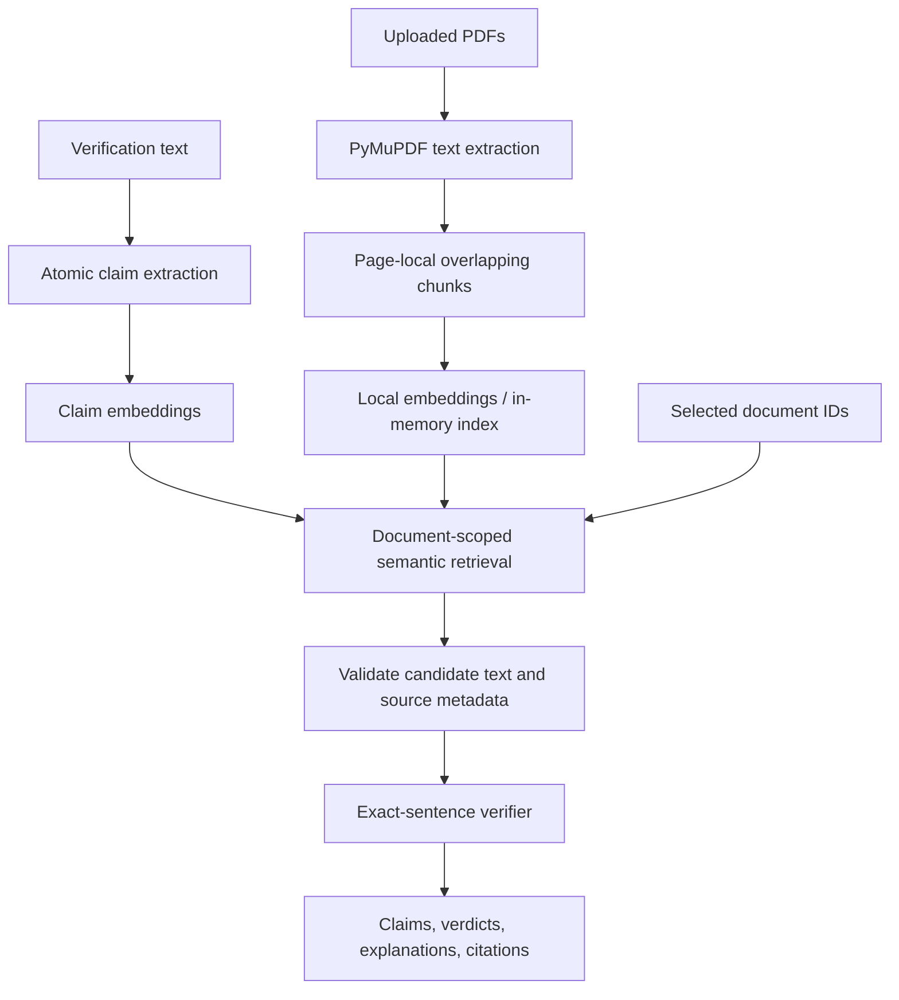

# EvidenceLens

Check factual text against user-supplied PDF documents, with document and page citations.

## Current milestone: atomic claims and semantic retrieval

The first vertical slice has been extended incrementally. PDF uploads, the two API contracts, source selection, result classifications, and expandable citations remain compatible. No accounts, authentication, payments, document persistence, or advanced semantic verifier have been added.



### Claim extraction

`AtomicClaimExtractor` implements the existing `ClaimExtractor` protocol with deterministic English heuristics. It recognizes common predicates, splits independent clauses and simple shared-subject predicates, preserves reporting phrases, and skips obvious opinions and questions. It does not split every occurrence of “and.” Conditions, negation, modality, quotes, and reported clauses are conservatively retained when splitting could change meaning.

For example:

> The study included 312 adults. Participants completed the survey online, and researchers found that sleep quality improved after the intervention.

becomes three typed claims: “The study included 312 adults.”, “Participants completed the survey online.”, and “Researchers found that sleep quality improved after the intervention.”

All output passes a bounded Pydantic schema. `StructuredClaimExtractor` is an optional injection adapter for a future `StructuredClaimProvider`; it accepts only JSON `{ "claims": [{ "text": "..." }] }`, rejects extra fields, wrong types, blank text, oversized responses, and more than 100 claims, and reports malformed output as HTTP 502. No generative model is configured or called by default. Schema validation checks structure, not whether a model preserved the input's meaning.

### Chunking and embeddings

PDF text is split into verbatim page-local windows, default maximum **1,000 characters**, with up to **150 characters of overlap**. The splitter prefers sentence boundaries, then word boundaries. Long sentences or tokens can require a hard cut. Whitespace trimming is the only change to citation text. Chunks never cross pages; every chunk retains its own document UUID, filename, one-based page number, and passage UUID.

The smaller windows reduce topic dilution and overlap retains some surrounding context. Internal chunk metadata tracks which original page sentences remain complete, so a hard-cut sentence fragment cannot become exact-match support. This metadata does not change the evidence API. Character limits are a practical English approximation, not a tokenizer limit: unusual text can still exceed a model's token budget, and tables, complex PDF reading order, and sentences spanning pages remain limitations. Overlapping passages may both be retrieved.

`FastEmbedProvider` implements a replaceable `EmbeddingProvider` with separate document and query methods. The default is **`sentence-transformers/all-MiniLM-L6-v2`**, a local CPU embedding model run through FastEmbed/ONNX. The model was chosen after comparing it with BGE-small on the committed fixtures; MiniLM ranked the intended source first for every positive fixture. This small evaluation is not a general quality benchmark. See [FastEmbed retrieval usage](https://qdrant.github.io/fastembed/qdrant/Retrieval_with_FastEmbed/) and [supported models](https://qdrant.github.io/fastembed/examples/Supported_Models/).

Uploads generate chunk embeddings before documents become available. Vectors are validated for count, dimensions, finite values, and nonzero norm. `SemanticRetriever` caches up to 4,096 content-keyed vectors in memory, reuses them for subsequent requests, and recomputes evicted entries as needed. It ranks only the selected passages by cosine similarity using a simple linear scan; no vector database is required for this local milestone. Query and document vectors always use the same provider instance/model.

### Trust boundaries and verifier limitations

- Selection is applied **before** ranking: retrieval receives only passages belonging to the requested document IDs. Cached vectors do not expand this candidate set.
- The API independently checks each returned passage ID, text, document ID/name, and page number against the selected originals **before** calling the verifier. Altered or foreign evidence fails closed with HTTP 502.
- Similarity only ranks candidate evidence. It is not exposed as confidence, reliability, or proof of support.
- The verifier receives one claim and its retrieved passages. It never searches or consults outside knowledge. Exact complete sentence matches after whitespace normalization return `supported`; all other cases return `insufficient_evidence`.
- “More than 300 people took part in the trial” retrieves “The trial enrolled 312 participants,” but remains `insufficient_evidence` under this temporary verifier. A relevant negated passage is also retrieved without becoming support.
- `partially_supported` and `contradicted` remain reserved for the next verifier milestone. Exact quotation is not proof of source truth and does not resolve conflicting sources or surrounding qualification.

Atomic extraction is conservative rather than a full parser: uncommon verbs, pronouns, embedded propositions, non-English input, opinions containing facts, lists, and complex syntax can be missed or remain compound. Some false factual candidates can survive filtering. An all-opinion input may return an empty results list; the UI explains this. Embeddings can miss relevant evidence; numbers and negation still need semantic verification. Neither the model nor the default threshold guarantees relevance.

## Run

Requires Python 3.11+ and Node.js 20.9+. Run commands from the repository root unless indicated.

```powershell
python -m venv venv
.\venv\Scripts\python.exe -m pip install -e "./backend[dev]"
.\venv\Scripts\python.exe -m app.prepare_model
.\venv\Scripts\python.exe -m uvicorn app.main:app --app-dir backend --reload --host 127.0.0.1
```

Preparing the model requires network access once to download public weights (roughly 90 MB for the default model). Document text and claims are never uploaded to a model service. Weights are cached under `.cache/fastembed`; user documents and their vectors remain in process memory. Preparation is optional but avoids first-upload latency. Once cached, set `$env:HF_HUB_OFFLINE='1'` for offline operation. Missing or failed embeddings return HTTP 503; there is no silent lexical fallback.

In a second terminal:

```powershell
cd frontend
npm ci
npm run dev
```

Open http://localhost:3000. The frontend proxies `/api/*` to `http://127.0.0.1:8000`; set `BACKEND_URL` before building/starting Next.js to change it. Interactive API docs: http://127.0.0.1:8000/docs.

Documents disappear on backend restart. Run one backend worker for this local workspace; there is no cross-worker/shared-user document store.

## Configuration

`.env.example` lists the process environment variables. It contains no secrets and is not automatically loaded. Set values in your shell before starting the backend, for example `$env:EVIDENCELENS_RETRIEVAL_TOP_K='3'`.

| Variable | Default | Purpose |
| --- | --- | --- |
| `EVIDENCELENS_EMBEDDING_MODEL` | `sentence-transformers/all-MiniLM-L6-v2` | Supported FastEmbed text model |
| `EVIDENCELENS_EMBEDDING_CACHE_DIR` | Repository `.cache/fastembed` | Writable weight cache |
| `EVIDENCELENS_EMBEDDING_THREADS` | `2` | CPU inference threads, 1–32 |
| `EVIDENCELENS_RETRIEVAL_TOP_K` | `5` | Maximum passages per claim, 1–50 |
| `EVIDENCELENS_RETRIEVAL_MIN_SIMILARITY` | `0.45` | Minimum cosine score, −1 to 1 |
| `EVIDENCELENS_CHUNK_MAX_CHARS` | `1000` | Window bound, 100–2000 |
| `EVIDENCELENS_CHUNK_OVERLAP_CHARS` | `150` | Target overlap, 0–500 and smaller than window |

The threshold was checked against the small evaluation fixtures; tune it on representative documents for each embedding model. Higher thresholds improve precision at the risk of missing evidence. Restart and re-upload documents when changing model/chunking settings. Invalid settings fail startup.

## API contracts

- `Document`: UUID, original filename, page count, passage count.
- `Passage` / `Evidence`: passage UUID, document UUID/name, one-based page number, source text.
- `Claim`: UUID and claim text.
- `VerificationResult`: claim, classification, explanation, retrieved evidence.
- `POST /api/documents`: multipart `files`; returns `201 {documents: Document[]}`. Upload batches are atomic from the document store's perspective, including embedding failures. A failed batch may leave reusable derived vectors in the bounded memory cache, but makes no documents queryable.
- `POST /api/verifications`: JSON `{text: string, document_ids: UUID[]}`; returns `{results: VerificationResult[]}`. Unknown document IDs fail before extraction/retrieval.
- Limits: 10 PDFs per upload, 10 MiB each, 200 pages each, 2 million extracted characters per file, 100 documents per process; 20,000 verification characters, 100 selected IDs, 100 sentence candidates and 100 extracted claims. Image-only and encrypted PDFs are rejected.
- Errors: `413` upload size/capacity, `422` invalid input/PDF/claim count, `404` unknown document, `502` invalid claim-provider output or evidence scope violation, `503` embedding service failure. No partial verification response is returned on service failure.

## Tests and examples

Deterministic regression suite (no model downloads):

```powershell
.\venv\Scripts\python.exe -m pytest backend/tests -q
```

Complete suite including real embedding evaluation, after preparing the model:

```powershell
$env:EVIDENCELENS_TEST_MODEL='1'
$env:HF_HUB_OFFLINE='1'
.\venv\Scripts\python.exe -m pytest backend/tests -q
```

The ordinary suite skips seven explicitly marked real-model tests. Unit tests use named stubs only for deterministic index math and boundary checks; the real model tests exercise all committed paraphrase/negation fixtures and PDF-to-verification scoping. Fixtures live in `sample_data/semantic_cases.json`.

```powershell
cd frontend
npm run typecheck
npm run build
```

Generate PDFs with `.\venv\Scripts\python.exe sample_data/generate_sample.py` (original observatory demo) or `.\venv\Scripts\python.exe sample_data/generate_semantic_sample.py`. Upload `semantic-trial.pdf` and paste “More than 300 people took part in the trial.” The top candidate should cite page 1, “The trial enrolled 312 participants.” The verdict remains `insufficient_evidence`. The blood pressure fixture on page 2 demonstrates relevant contradictory wording without an unsupported positive verdict.

### Dependency warnings

The deprecated HTTPX TestClient fallback was resolved by using `httpx2` in development dependencies. Starlette 1.6.0 still references `anyio.abc.BlockingPortal` in `starlette/testclient.py:53`; AnyIO 4.15.1 emits a deprecation warning recommending `anyio.from_thread.BlockingPortal`. This is third-party code; the warning remains visible rather than being suppressed or patched locally.

On Windows, initial weight downloads may warn about unavailable symlinks (additional disk usage) and unauthenticated Hugging Face requests (lower rate limits). FastEmbed can use its alternate download source if necessary. These do not require API keys or changes to verification behavior.

Next milestone: replace the verifier with tested, evidence-grounded semantic support/partial-support/contradiction decisions. Persistent storage remains out of scope.
